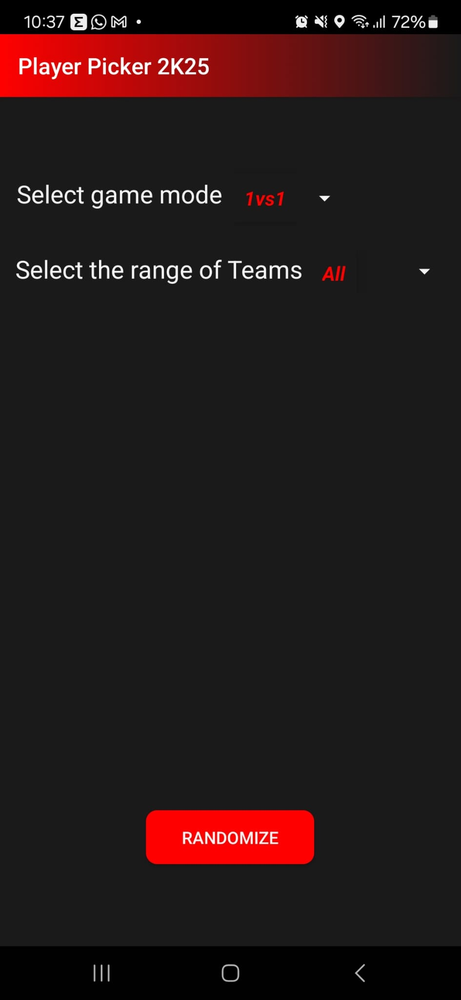

# NBA 2K Random Team Generator

An Android application for generating random NBA teams, designed to make team selection easy and fun for NBA enthusiasts.

I enjoyed making this application because I learned the basics of kotlin
and some things about servers and DBMS using MySQL and wampserver for hosting
my database of players and teams.

## Features

- Randomizes NBA teams for gameplay or other purposes.
- Clean UI to ensure ease of use.
- Lightweight and efficient.

## Screenshots

## Installation

1. Clone the repository or download the ZIP.
2. Open the project in **Android Studio**.
3. Sync Gradle to ensure all dependencies are downloaded.
4. Connect an Android device or start an emulator.
5. Build and run the application.

## Project Structure

- **`app/src/main/`**: Contains the source code and resources for the app.
  - **Java Files**:
    - `MainActivity.kt`: The main entry point for the app.
    - `RandomizeGame.kt`: Handles the team randomization logic.
    - `ShowPlayer.kt`: Manages player display.
  - **Resources**:
    - Layouts: XML files defining the UI (`activity_main.xml`, `activity_show_player.xml`).
    - Drawables: App icons and other drawable assets.
    - Values: Strings, themes, and colors used in the app.
- **`AndroidManifest.xml`**: Describes essential app information.
- **Gradle Files**: Contains build scripts and dependency configurations.

## Prerequisites

- Android Studio Dolphin or later.
- Minimum Android SDK version 21.

## How to Use

1. Launch the app on your device.
2. Select options for randomization (if applicable).
3. Generate teams with a single tap.

## Contributing

Feel free to fork this project, make improvements, and create pull requests. Contributions are always welcome!
