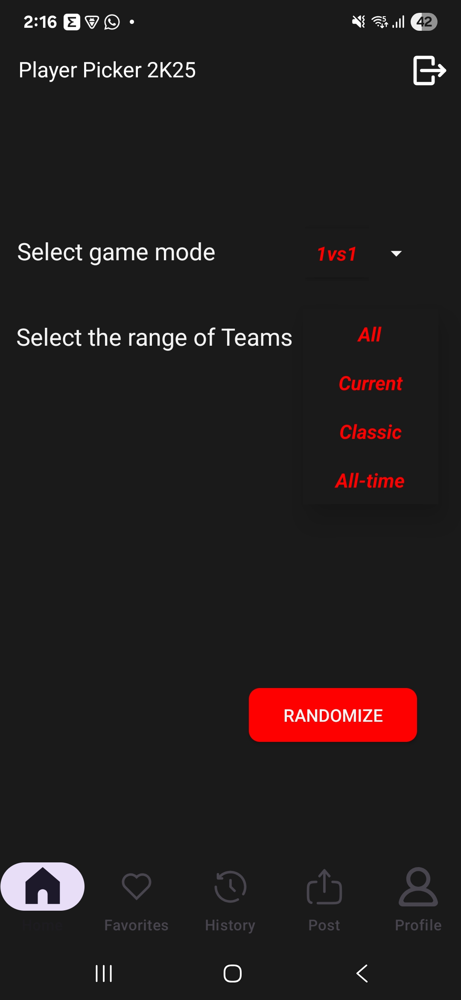

# NBA 2K Random Team Generator
### Readme needs an update

An Android app that generates fair, random NBA teams and lets you save, revisit, and manage matchups — built with **Kotlin**, **Jetpack Compose (Material 3)**, and **Firebase**.

> **Author:** Stefan Calmac  
> **Android versions:** 24 → 36 (36)  
> **Gradle versions:** 8.13.0, 
> **Java/Kotlin:** 17, 2.2.21

---

## ✨ Features

- **One-tap team randomizer** – Generates balanced teams from your player pool.
- **Modern UI with Jetpack Compose** – Material 3 design, edge-to-edge layouts, and smooth navigation.
- **Bottom navigation** – `Home`, `Favorites`, `History`, `Post`, `Profile` routes via Navigation-Compose.
- **Save & manage matches** – Persist matchups and quickly revisit them later.
- **Auth powered by Firebase** – Email/password sign-in and session handling.
- **Interoperability** – Uses `AndroidViewBinding` where needed alongside Compose.
- **Lightweight & fast** – Minimal dependencies, Kotlin-first codebase.

---

## 🧱 Tech Stack

- **Language:** Kotlin
- **UI:** Jetpack Compose (Material 3), Navigation-Compose
- **State:** Compose state + `remember`/`mutableStateOf`
- **Firebase:** Authentication, Cloud Firestore
- **Serialization:** `kotlinx.serialization` (for `Team` / `PlayerWithTeam` JSON)
- **Build:** Gradle (KTS/Groovy), Android Gradle Plugin

> Notable files from this repo snapshot:
> - `MainActivity.kt` – app scaffold, top/bottom bars, Compose navigation host, sign-out dialog
> - `RandomizeGame.kt` – core team randomization & models (`Team`, likely `PlayerWithTeam`)
> - `ManageMatches.kt` – saved matches workflow
> - `LoginActivity.kt`, `LoginService.kt`, `SignUpService.kt` – authentication flows (Firebase)
> - `NavigationItem.kt` – bottom nav routes + icons
> - `StringListAdapter.kt` – simple RecyclerView adapter used via view binding interop

---

## 🗺️ App Flow (High-level)

1. **Auth**: Users sign up or sign in with Firebase Auth. Session duration is managed app-side.
2. **Home**: Entry point with actions to randomize teams.
3. **Randomize**: Generates two teams; shows a composed screen (`ShowPlayerScreen`) with options to save as a named match.
4. **Save/Manage Matches**: Persists to Firestore; view and manage in **Matches** (via `ManageMatches.kt`).
5. **Explore/Favorites/Profile**: Present and planned screens wired into bottom navigation.

---

## 📸 Screenshots

---

# 🧪 How to Use
- Sign In / Sign Up with email and password.
- Tap Randomize to generate two teams.
- Save the matchup with a memorable name.
- Find and manage saved matches in the dedicated screen.
- Navigate between Home, Favorites, Explore, Post, and Profile from the bottom bar.

---

# 🚀 Roadmap Ideas
- Import/export player pools
- Seeding & fairness options (e.g., positions/ratings)
- Offline cache of saved matches
- Dynamic color (Material You) support
- UI tests and snapshot tests

---

# 🤝 Contributing

Contributions and suggestions are welcome! Feel free to open an issue or a pull request.
